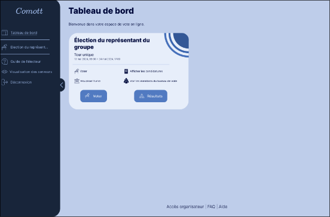

# Paillier-Threshold

This repo contains the backend of a website demonstrating the use and security of Paillier's cryptosystem.
The website's frontend git : https://github.com/uvsq21919161/Vote_securise

The website is not available anymore sadly :/

To compensate, here are some screenshots of what it looked like :

